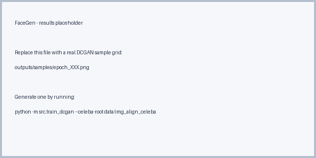
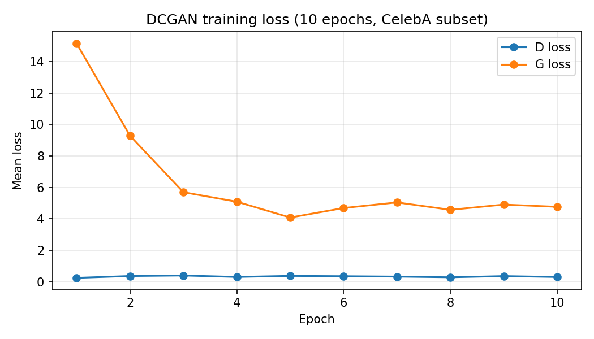
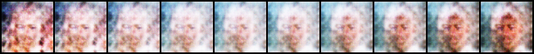
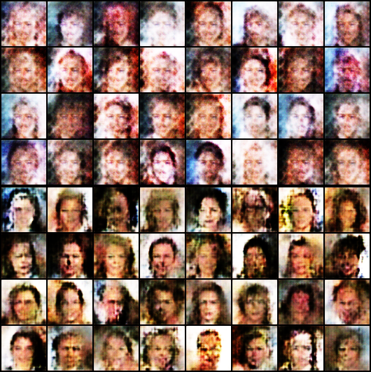
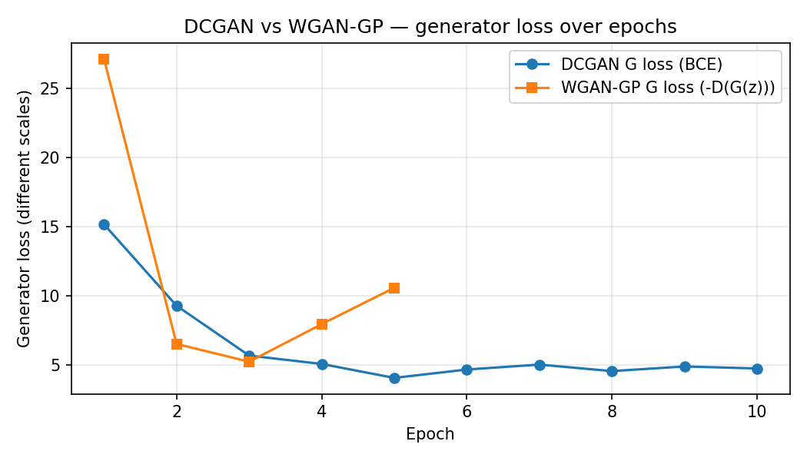

# FaceGen: Generating Human Faces Using Deep Convolutional GANs

A course image-generation project: train a GAN **from scratch** on human faces and study how training and the latent space behave.

## 1. Project name and overview

**FaceGen: Generating Human Faces Using Deep Convolutional GANs.**

The model learns to generate 64×64 RGB human faces from random noise. Training is done **from scratch on CelebA** with two objectives implemented on the **same DCGAN backbone**:

- **Baseline:** **DCGAN** with binary cross-entropy adversarial loss.
- **Extension:** **WGAN-GP** (Wasserstein critic + gradient penalty) for more stable training.

The repository ships training scripts for both, a CelebA folder dataset, a latent-space interpolation utility, and per-epoch sample grids so progress is visible in the file system.

## 2. Installation and run instructions

**Requirements:** Python 3.10+ and the packages in `requirements.txt` (PyTorch, torchvision, NumPy, Pillow, tqdm, matplotlib). A CUDA GPU is strongly recommended; CPU works for smoke tests only.

```bash
python -m venv .venv
.venv\Scripts\activate         # Windows PowerShell: .venv\Scripts\Activate.ps1
pip install -r requirements.txt
```

**Get CelebA** (aligned & cropped) and place the image files locally, for example:

```
data/img_align_celeba/000001.jpg
data/img_align_celeba/000002.jpg
...
```

CelebA is **not** committed; the loader scans whatever directory you pass to `--celeba-root`.

**Train the DCGAN baseline:**

```bash
python -m src.train_dcgan --celeba-root data/img_align_celeba --epochs 5 --batch-size 128
```

Outputs:
- `outputs/samples/epoch_XXX.png` — 8×8 grid of fixed-noise samples per epoch.
- `outputs/logs/dcgan_losses.csv` — mean per-epoch generator and discriminator losses.
- `checkpoints/generator_final.pt`, `checkpoints/discriminator_final.pt`.

**Train the WGAN-GP extension** (separate output directory so DCGAN runs are preserved):

```bash
python -m src.train_wgan_gp --celeba-root data/img_align_celeba --epochs 5 --batch-size 64
```

Outputs land under `outputs/wgan_gp/` and `checkpoints/wgan_gp_*_final.pt`.

**Latent-space interpolation** between two random noise vectors using a saved generator:

```bash
python -m src.interpolate_latent --generator-weights checkpoints/generator_final.pt --steps 10 --out outputs/samples/latent_interpolation.png
```

**Plot loss curves** from a training CSV:

```bash
python -m src.plot_losses --csv outputs/logs/dcgan_losses.csv --out outputs/samples/loss_curve.png --title "DCGAN training loss"
```

## 3. Results

DCGAN generator samples after **10 epochs** on a 10,000-image CelebA subset (RTX 4050 Laptop GPU, batch size 128, latent dim 100). The grid is produced from a **fixed noise vector** so progress can be compared across epochs.



### Training convergence



The generator loss drops sharply from **~15 → ~4** in the first three epochs and then stabilizes; the discriminator loss settles around **0.25–0.40**, which is the expected DCGAN equilibrium. The full per-epoch CSV is at [`outputs/logs/dcgan_losses.csv`](outputs/logs/dcgan_losses.csv); the plot is regenerated by `python -m src.plot_losses --csv outputs/logs/dcgan_losses.csv --out outputs/samples/loss_curve.png`.

### Latent-space interpolation

A linear walk between two random latent vectors `z0` and `z1`, decoded by the trained generator at 10 evenly-spaced points:



The smooth morphing of identity, lighting, and pose along the row is evidence that the generator has learned a **continuous mapping** rather than memorizing training examples. Reproduce with `python -m src.interpolate_latent --generator-weights checkpoints/generator_final.pt --steps 10 --out outputs/samples/latent_interpolation.png`.

Per-epoch grids are committed under `outputs/samples/epoch_001.png` through `epoch_010.png` so the full **training progression** is browsable directly on GitHub.

### DCGAN vs WGAN-GP (model comparison)

The repository also includes a WGAN-GP run on the same backbone and dataset (5 epochs, batch size 64, `n_critic=5`, `gp_lambda=10`). The two trained generators are decoded on the **same latent batch** to make differences in style and stability directly visible.





Notes on the run:

- DCGAN's BCE generator loss settles in the ~4–5 band after ~3 epochs (textbook equilibrium).
- WGAN-GP's generator loss is `-D(G(z))` and is on a different scale; the **Wasserstein estimate** (real − fake critic scores) is the right convergence signal there. It drops from ~43 at epoch 1 to ~22 by epoch 3 and stays in the 22–30 band, with gradient-penalty values around 0.6–1.1 (close to the target gradient norm of 1).
- Visually, WGAN-GP samples after 5 epochs show comparable face structure to DCGAN at 10 epochs with arguably more variety, consistent with WGAN-GP's reputation for more stable training given a similar compute budget.

Regenerate either artifact with:

```bash
python -m src.train_wgan_gp --celeba-root data/celeba_subset --epochs 5 --batch-size 64
python -m src.compare_models
```

## 4. Extra criteria pursued

Concretely shipped in this repository, with **artifacts checked into the repo**:

| Extra criterion | What is implemented | Artifact |
|---|---|---|
| **Latent-space exploration** | `src/interpolate_latent.py` performs a 10-step linear walk between two random latent vectors and decodes through the trained generator. Smooth morphing of identity, lighting, and pose. | [`outputs/samples/latent_interpolation.png`](outputs/samples/latent_interpolation.png) |
| **Tracking / metrics** | Mean per-epoch **generator and discriminator losses** logged to CSV during training; rendered as a labeled loss curve via `src/plot_losses.py`. WGAN-GP additionally tracks the **Wasserstein estimate** and **gradient-penalty** value. | [`outputs/samples/loss_curve.png`](outputs/samples/loss_curve.png), [`outputs/logs/dcgan_losses.csv`](outputs/logs/dcgan_losses.csv) |
| **Image gallery** | A sample grid from a fixed noise vector is saved **every epoch**, so the visual progression of training is browsable directly on GitHub. | `outputs/samples/epoch_001.png` … `epoch_010.png` |
| **Hyperparameter exposure** | All training knobs are CLI flags: learning rate, batch size, latent dim `nz`, generator/discriminator widths (`ngf`, `ndf`), Adam betas, and (WGAN-GP only) `n_critic` and `gp_lambda`. Every run is fully described by its command line. | `src/train_dcgan.py`, `src/train_wgan_gp.py` |
| **Model comparison** | DCGAN vs. WGAN-GP share the **same backbone, dataset, and image size**. Both models are trained, weights saved, and decoded on the same latent batch for a direct visual comparison. | [`outputs/samples/comparison_samples.png`](outputs/samples/comparison_samples.png), [`outputs/samples/comparison_loss.png`](outputs/samples/comparison_loss.png), `src/compare_models.py` |

## 5. Difficulties faced and how they were solved

- **GAN training instability.** Vanilla GAN training oscillates and can mode-collapse. Mitigations: DCGAN architecture conventions (strided convolutions, BatchNorm, LeakyReLU in the discriminator), DCGAN-style weight init (Normal(0, 0.02)), Adam with `beta1=0.5` for the baseline, and an **alternative WGAN-GP** trainer that uses a critic with gradient penalty for a smoother optimization landscape.
- **Comparing DCGAN and WGAN-GP fairly.** Different output folders and CSV log filenames so runs do not overwrite each other (`outputs/samples/` vs. `outputs/wgan_gp/samples/`), while sharing the same generator/discriminator code in `src/dcgan.py`.
- **Logging without bloating commits.** Per-epoch CSV summaries instead of per-batch logs (cheaper I/O, smaller logs) and `.gitignore` rules for `data/`, `checkpoints/`, and generated artifacts.
- **Cross-platform path handling.** Used `pathlib.Path` everywhere and avoided shell-specific commands so the scripts work on both Windows PowerShell and POSIX shells.
- **Process expectations (small commits).** Built incrementally: proposal/layout, then dataset and DCGAN trainer, then WGAN-GP and latent interpolation. The git history shows distinct stages instead of a single end-of-term dump.

## Repository layout

```
data/                       # CelebA (not committed; place locally)
outputs/samples/            # DCGAN sample grids per epoch
outputs/wgan_gp/samples/    # WGAN-GP sample grids per epoch
outputs/logs/               # Loss CSVs (local; gitignored)
src/
  dataset.py                # CelebAFolderDataset (resize, crop, normalize)
  dcgan.py                  # DCGAN Generator + Discriminator + weight init
  wgan_gp.py                # gradient_penalty()
  train_dcgan.py            # DCGAN training entrypoint
  train_wgan_gp.py          # WGAN-GP training entrypoint
  interpolate_latent.py     # latent-space interpolation utility
  plot_losses.py            # render loss-curve PNG from a training CSV
  compare_models.py         # build DCGAN-vs-WGAN-GP side-by-side artifacts
  download_celeba_subset.py # fetch a small CelebA subset from a HF mirror
checkpoints/                # Saved weights (gitignored)
```

See [`CODE_EXPLANATION.md`](CODE_EXPLANATION.md) for a brief module-by-module walkthrough.

## Notes

- **Repo:** Private; collaborators `jdeandria` and `barrieca` are invited per course instructions.
- **Commit cadence:** Weekly small commits to reflect the development process, not a one-shot upload.
